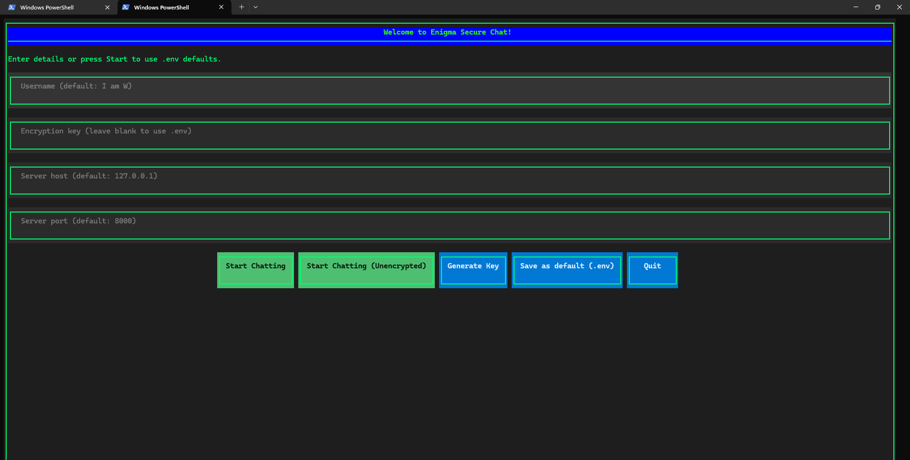
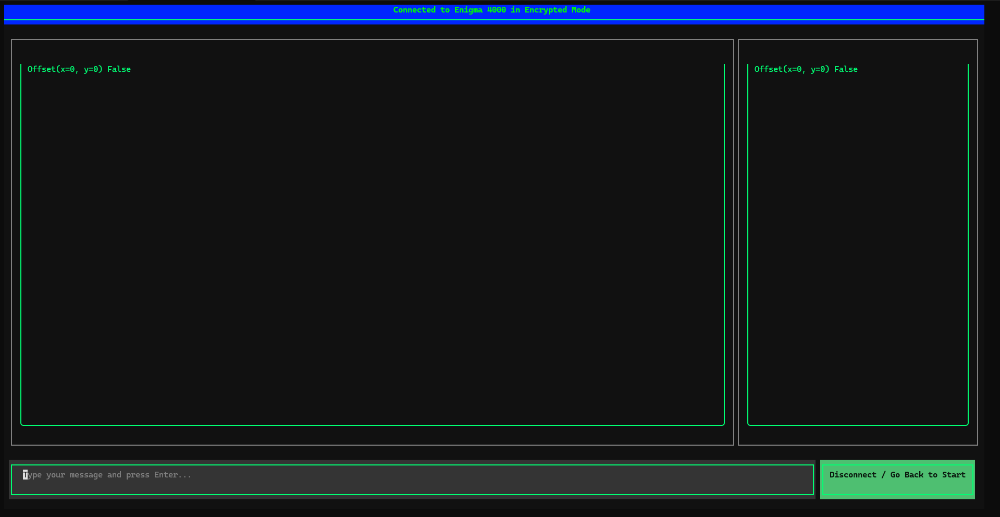

# Enigma

Enigma is a TUI or Terminal UI chatting client and is also a type of IRC as no chat is saved in the server

It uses Fernet to encrypt and decrypt user messages and there is no way in the server to decode that.

The server just acts like a Relay for both Encrypted AND Unencrypted messages

You have to find some way to give the key to your friend though or try our unencrypted chat room (Only one room for Now)

# How does it work?

It uses Python's AsyncIO to start a server where your Client Side code can send the Data and the Server Relays it to every other computers Connected

# How is it Secure

Because it uses client side encryption/decryption, you have to give the decryption key to your friend somehow old school else he won't be able to decode that

# Extra Features

1. Duplicate Username Check
2. UI that gives Hacker Vibe

# Image 

